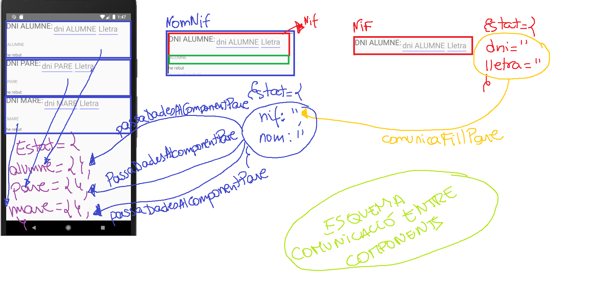

# provaEstats
En aquesta branca, mostrem la solució a l'ejercici plantejat a classe. En ell, sobre la marxa ferem:
1. Creàrem l'estructura de directoris adequada (carpetes **src**, **components**). No ens calien més. I moguerem *App.js* dins **src** i modificarem *index.js* per a que apunte a *App.js* de manera correcta.
1. Creàrem un component anomenat Nif, que obté un dni i calcula la lletra del nif que li correspon.
1. Creàrem un component NomNif, que ha d'obtindre un nif i el nom d'una persona. NomNif és el component pare de Nif.
1. Quan Nif ja té el dni i la lletra es comunica amb el seu pare **NomNif** mitjançant la funció que es troba a la propietat *comunicaFillPare*, i li passa el dni+lletra
1. Quan el component **NomNif** ja té un nom i un nif, es comunica amb el component pare (*App*) mitjançant la funció indicada a la propietat *passaDadesAlComponentPare*, per a guardar eixes dades a l'estat del component Pare (*App*)
Vegeu la següent imatge per veure si us aclareix una miqueta les coses, ja que costa una miqueta d'explicar.

